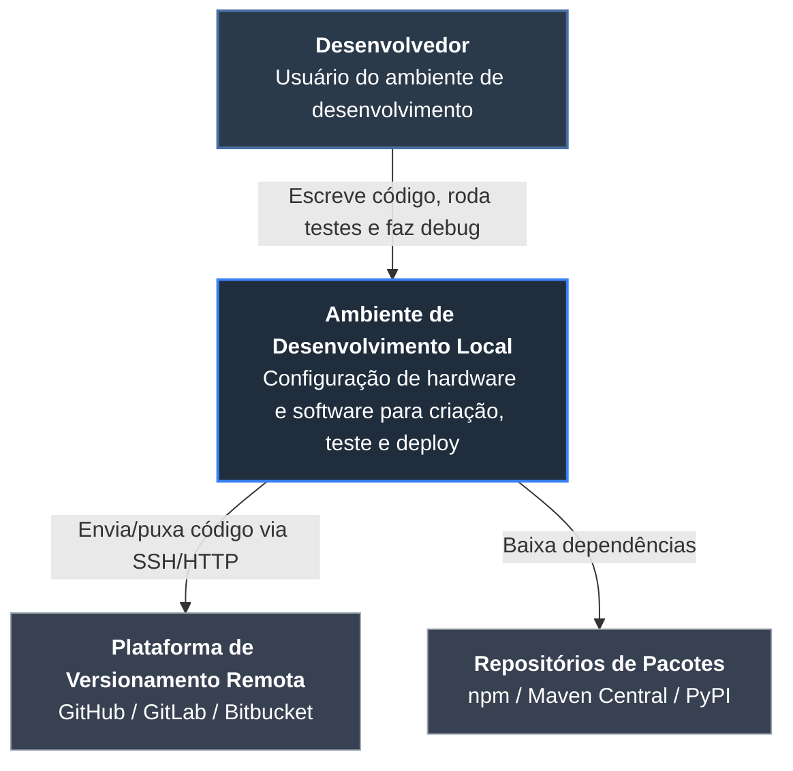
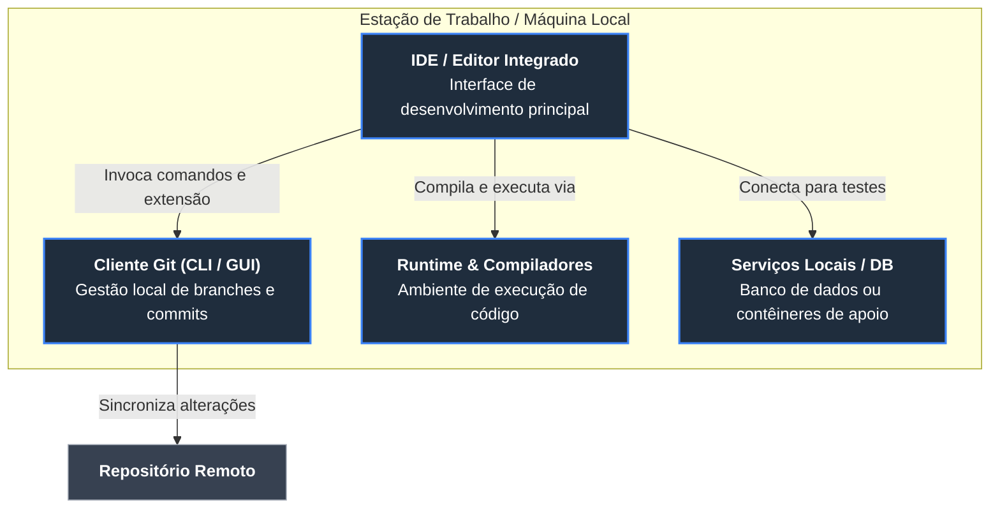
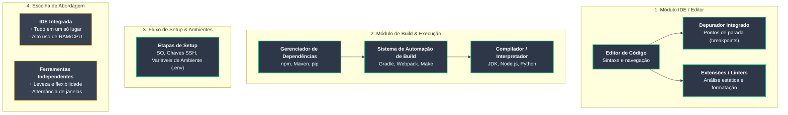

# Arquitetura As-Is: Ambiente de Desenvolvimento de Software

Documento de arquitetura estruturado nos **4 níveis do Modelo C4**, com **Nível 4 otimizado visualmente** para legibilidade no VS Code e GitHub.

---

## Nível 1: Diagrama de Contexto (System Context)

---

## Nível 2: Diagrama de Contêineres (Containers)

---

## Nível 3: Diagrama de Componentes (Components)

---

## Nível 4: Diagrama de Execução & Fluxo de Código (Otimizado)

O Nível 4 foi reestruturado com **blocos visuais de ativação**, **distinção clara entre o fluxo de IDE Integrada e CLI Independente**, e **rótulos explicativos**.

```mermaid
sequenceDiagram
    autonumber
    actor Dev as 👨‍💻 Desenvolvedor
    participant IDE as 🖥️ IDE Integrada (GUI)
    participant Term as 💻 Terminal CLI
    participant Git as 🌿 Git (VCS)
    participant Dep as 📦 Gerenciador Dep.
    participant Runtime as ⚙️ Runtime / OS

    %% ==========================================
    %% CENÁRIO 1: ABORDAGEM IDE INTEGRADA
    %% ==========================================
    rect rgb(30, 41, 59)
        note over Dev, Runtime: 🔵 CENÁRIO A: Fluxo Unificado via IDE Integrada (Visual & Automatizado)
        
        Dev->>+IDE: 1. Ação de Debug / Build (Clique no Botão "Run")
        
        IDE->>+Git: 2. Verifica status do repositório / Branch ativa
        Git-->>-IDE: Confirmação de status (Clean/OK)
        
        IDE->>+Dep: 3. Resolução automática de dependências
        Dep-->>-IDE: Pacotes verificados / atualizados
        
        IDE->>+Runtime: 4. Inicializa processo com depurador ativo (Breakpoints)
        activate Runtime
        Runtime-->>IDE: 5. Transmite logs de console em tempo real e intercepta breakpoints
        deactivate Runtime
        
        IDE-->>-Dev: 6. Exibe estado da aplicação, variáveis em memória e stack trace
    end

    %% ==========================================
    %% CENÁRIO 2: ABORDAGEM FERRAMENTAS INDEPENDENTES
    %% ==========================================
    rect rgb(45, 30, 20)
        note over Dev, Runtime: 🟠 CENÁRIO B: Fluxo Desacoplado via CLI (Manual & Multi-Janela)
        
        Dev->>+Term: 1. Executa 'git checkout feature & git status'
        Term->>+Git: Consulta estado local
        Git-->>-Term: Retorna branch e alterações
        Term-->>-Dev: Exibe resultado no terminal
        
        Dev->>+Term: 2. Executa 'npm install' / 'mvn clean install'
        Term->>+Dep: Baixa e resolve dependências
        Dep-->>-Term: Conclui instalação de pacotes
        Term-->>-Dev: Exibe log de dependências
        
        Dev->>+Term: 3. Executa 'npm start' / 'java -jar app.jar'
        Term->>+Runtime: Dispara processo de execução no SO
        Runtime-->>Term: Saída de texto bruta (stdout/stderr)
        Term-->>-Dev: Exibe logs diretos na janela do terminal
    end
```

---

## Como Rodar no VS Code / GitHub

1. **No VS Code:** Abra este arquivo e aperte `Ctrl + Shift + V` (ou `Cmd + Shift + V` no Mac).
2. **No GitHub:** Salve como `README.md` para ver os diagramas interativos direto no repositório.
