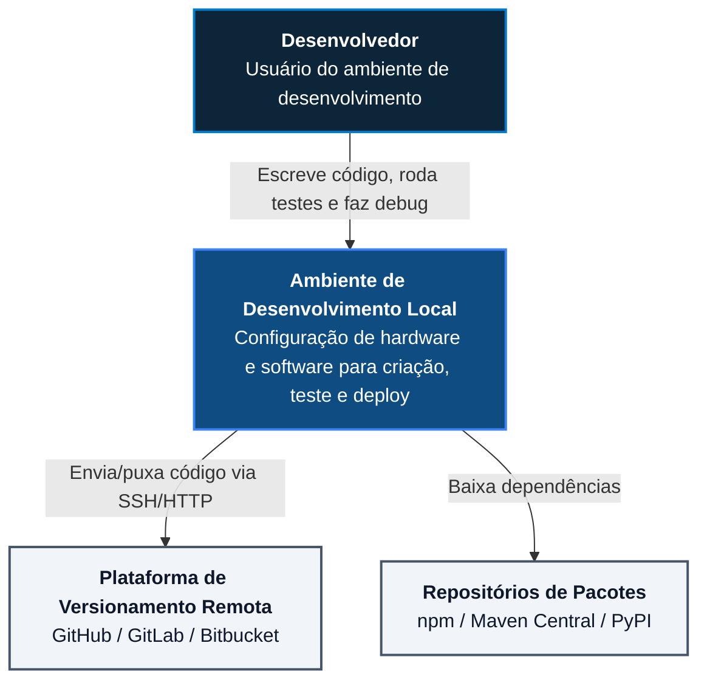
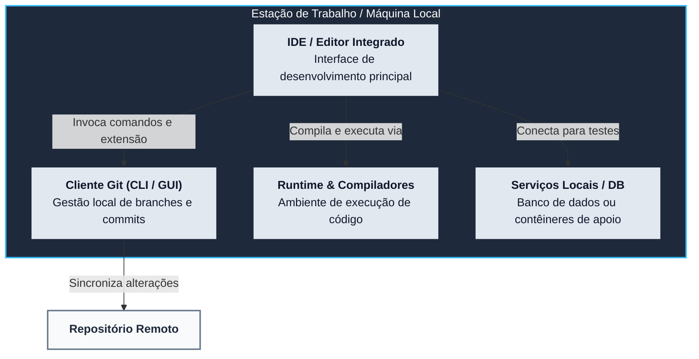
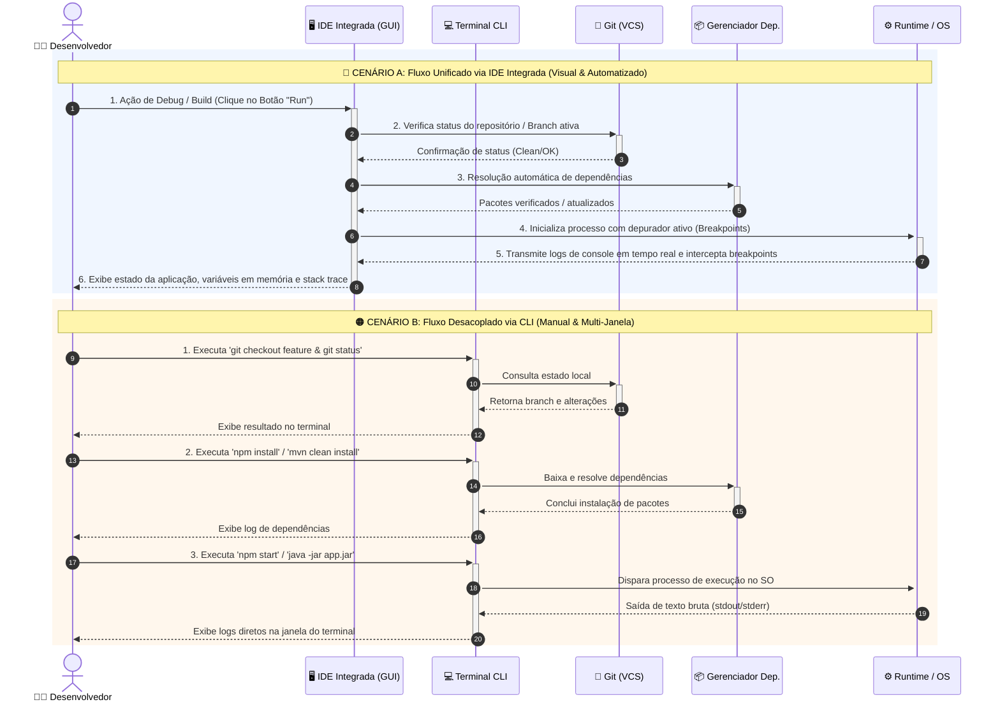

# Arquitetura As-Is: Ambiente de Desenvolvimento de Software

Documento de arquitetura nos **4 níveis do Modelo C4**, otimizado para **alto contraste de cores e legibilidade de textos** no VS Code e GitHub.

---

## Nível 1: Diagrama de Contexto (System Context)

---

## Nível 2: Diagrama de Contêineres (Containers)

---

## Nível 3: Diagrama de Componentes (Components)

```mermaid
graph TD
    %% Cores contrastantes por módulo
    classDef comp fill:#f1f5f9,stroke:#0f172a,stroke-width:1.5px,color:#0f172a;
    classDef option fill:#fef3c7,stroke:#d97706,stroke-width:2px,color:#78350f;

    subgraph IDEModule[" 1. Módulo IDE / Editor "]
        Editor["<b>Editor de Código</b><br/>Sintaxe e navegação"]:::comp
        Debugger["<b>Depurador Integrado</b><br/>Pontos de parada (breakpoints)"]:::comp
        Plugins["<b>Extensões / Linters</b><br/>Análise estática e formatação"]:::comp
    end

    subgraph BuildModule[" 2. Módulo de Build & Execução "]
        Deps["<b>Gerenciador de Dependências</b><br/>npm, Maven, pip"]:::comp
        BuildSys["<b>Sistema de Automação de Build</b><br/>Gradle, Webpack, Make"]:::comp
        Compiler["<b>Compilador / Interpretador</b><br/>JDK, Node.js, Python"]:::comp
    end

    subgraph ConfigModule[" 3. Fluxo de Setup & Ambientes "]
        SetupProcess["<b>Etapas de Setup</b><br/>SO, Chaves SSH, Variáveis (.env)"]:::comp
    end

    subgraph TradeOff[" 4. Escolha de Abordagem "]
        IDE_Approach["<b>IDE Integrada</b><br/>+ Tudo em um só lugar<br/>- Alto uso de RAM/CPU"]:::option
        CLI_Approach["<b>Ferramentas Independentes</b><br/>+ Leveza e flexibilidade<br/>- Alternância de janelas"]:::option
    end

    Editor --> Debugger
    Editor --> Plugins
    Deps --> BuildSys
    BuildSys --> Compiler

    %% Estilização dos containers/subgraphs
    style IDEModule fill:#0f172a,stroke:#38bdf8,stroke-width:2px,color:#ffffff
    style BuildModule fill:#0f172a,stroke:#34d399,stroke-width:2px,color:#ffffff
    style ConfigModule fill:#0f172a,stroke:#a78bfa,stroke-width:2px,color:#ffffff
    style TradeOff fill:#0f172a,stroke:#fbbf24,stroke-width:2px,color:#ffffff
```

---

## Nível 4: Diagrama de Execução & Fluxo de Código

---

## Como Rodar no VS Code / GitHub

1. **No VS Code:** Aperte `Ctrl + Shift + V` (ou `Cmd + Shift + V` no Mac).
2. **No GitHub:** Envie como `README.md` ou importe no repositório.
