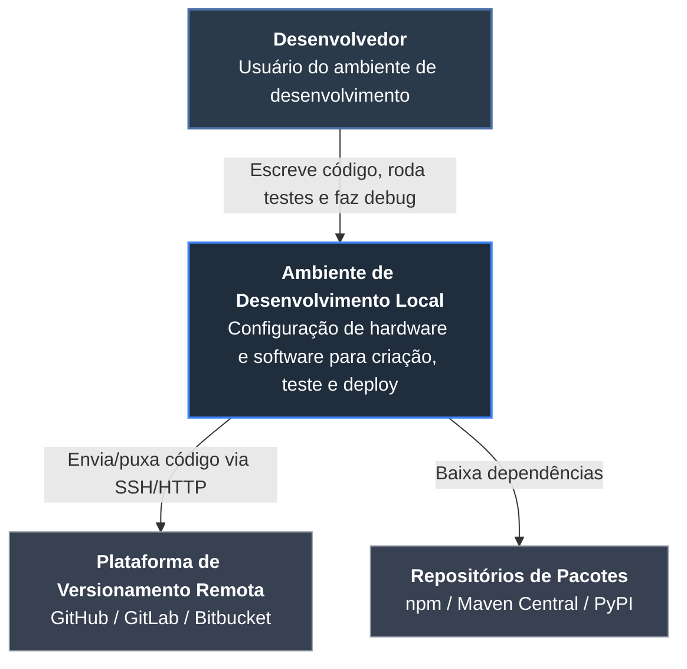
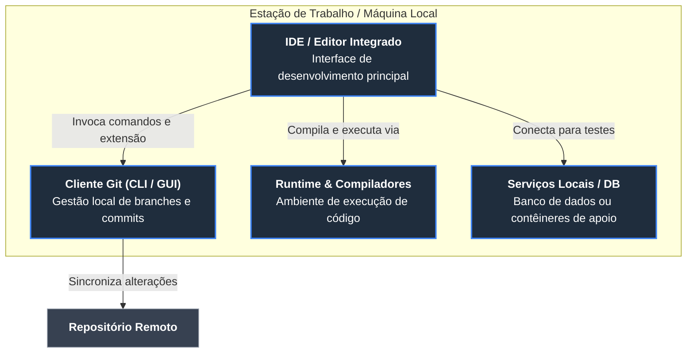
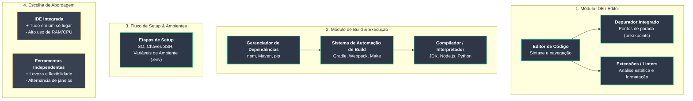

# Arquitetura As-Is: Ambiente de Desenvolvimento de Software

Documento de arquitetura estruturado nos **4 níveis do Modelo C4**, elaborado com base nas diretrizes de ambientes de desenvolvimento de software (definição, componentes, processo de setup e comparativo IDE vs. Ferramentas Independentes).

---

## Nível 1: Diagrama de Contexto (System Context)

O Nível 1 apresenta a visão geral do sistema em relação aos atores (desenvolvedores) e serviços externos envolvidos (repositórios de código e gerenciadores de pacotes).



---

## Nível 2: Diagrama de Contêineres (Containers)

O Nível 2 detalha as grandes unidades funcionais (softwares/sistemas) que compõem o ambiente de desenvolvimento local na máquina do desenvolvedor.



---

## Nível 3: Diagrama de Componentes (Components)

O Nível 3 detalha os módulos e subsistemas específicos internos de cada ferramenta, cobrindo edição, build, fluxo de instalação e o comparativo das abordagens.



---

## Nível 4: Diagrama de Execução / Processos (Code)

O Nível 4 demonstra o fluxo sequencial de interação entre componentes ao executar e depurar software, comparando a abordagem integrada com a abordagem por ferramentas independentes via CLI.

```mermaid
sequenceDiagram
    autonumber
    actor Dev as Desenvolvedor
    participant IDE as IDE / Editor
    participant Git as Git CLI
    participant DepManager as Gerenciador Dep.
    participant Runtime as Runtime / OS

    rect rgb(35, 50, 70)
        note over Dev, Runtime: Cenário A: Abordagem com IDE Integrada (Automática)
        Dev->>IDE: Clica em "Run/Debug"
        IDE->>Git: Valida branch ativa
        IDE->>DepManager: Resolve bibliotecas ausentes
        IDE->>Runtime: Executa processo com depurador ativo
        Runtime-->>IDE: Retorna saída do console e breakpoints
    end

    rect rgb(50, 40, 30)
        note over Dev, Runtime: Cenário B: Abordagem Independentes (Manual/CLI)
        Dev->>Git: Executa 'git checkout main' no terminal
        Dev->>DepManager: Executa 'npm install' ou 'mvn install'
        Dev->>Runtime: Executa scripts via CLI diretamente
        Runtime-->>Dev: Retorna saída bruta no terminal
    end
```



---

## Instruções de Uso

### 1. No GitHub
Basta salvar este arquivo como `README.md` ou `arquitetura-as-is.md` no seu repositório. O GitHub renderiza automaticamente os blocos `` ```mermaid `` nativamente.

### 2. No VS Code
Para visualizar e editar interativamente no VS Code:
1. Abra este arquivo (`.md`) no VS Code.
2. Instale a extensão **Markdown Preview Mermaid Support** (se usar a visualização padrão do Markdown) ou **Mermaid Preview**.
3. Pressione `Ctrl + Shift + V` (Windows/Linux) ou `Cmd + Shift + V` (macOS) para abrir o Preview nativo do VS Code.
